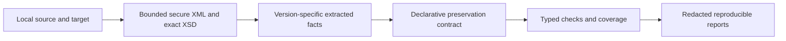

# MessageBench institutional discovery dossier

Audience: financial-software engineers, bank CTOs, central-bank technologists, development partners and open-source maintainers. This is an engineering artifact, not a regulatory proposal.

MessageBench checks whether externally supplied financial-message file pairs preserve the information promised by a versioned engineering contract. It runs offline, executes no adapter, and produces deterministic, redacted reports with explicit coverage limits.

Repository: https://github.com/aksum-labs/messagebench. Candidate: 0.2.0-rc.1. Supported scope: pacs.008.001.08 and pacs.002.001.10 only. Unsupported: camt.053, other versions, universal translation, full-document equivalence and all proprietary Ethiopian rules.

Architecture:

Technical abstract: Single-message validation does not specify the relationship promised by a transformation. Original synthetic pairs exhibit reference truncation, identifier loss and repeated-item changes while remaining schema-valid. A contract expresses which information must survive and which changes are allowed; incomplete evidence cannot produce a required PASS.

Evidence: 100 synthetic paired cases; 140 passing tests; 99/102 core semantic branches (97.06%); 40/40 targeted mutants killed; 200 XML documents with matching XSD classifications across lxml and xmlschema; 100,000 parser fuzz iterations and 10,000 contract mutations. These are automated synthetic results, not independent review or production adoption. The small local benchmark cycles six pairs; hardware and conditions are in evidence/benchmark.json.

Security: offline runtime, secure bounded XML, non-executable contracts, default report redaction, no adapter execution, pinned dependencies, native inventory, CI and provenance workflow. See SECURITY-EVIDENCE.md for actual earned checks/signatures and unresolved human/process limitations.

License: original code/corpus Apache-2.0; standards schemas retain separate terms. Foundation status: LFDT and FINOS proposals prepared, neither submitted nor accepted. Badge/Scorecard status must be read from external/recognition-matrix.json, not assumed from configured workflow files.

Citation: CITATION.cff; no DOI yet. Paper: the public 9-page paper/messagebench-benchmark.pdf and corresponding Markdown source. Release: no reviewed public release until the genuine review gate is satisfied. Current snapshot evidence can authenticate a workflow without implying reviewed release approval.

No independent human review or institutional adoption has been established. No certification, production-safety, national-standard or regulator/vendor endorsement claim is made. camt.053.001.08 is excluded because joint-contributor redistribution permission was not established. A PASS covers only listed assertions, never the whole document.

Actual public security signals (1 October 2026): OpenSSF Scorecard 6.4/10 at `2bb62cb`; successful hosted Checks, CodeQL, dependency review, full bounded fuzz campaigns and offline build/installation. Candidate checksum manifest signed through GitHub OIDC and verified by the hosted workflow. [Authentic attestation](https://github.com/aksum-labs/messagebench/attestations/51734116). This is a main-branch candidate snapshot, not a reviewed formal release. No Best Practices badge, DOI or foundation acceptance has been earned. See evidence/hosted-recognition.json for exact run IDs and artifact digests.
